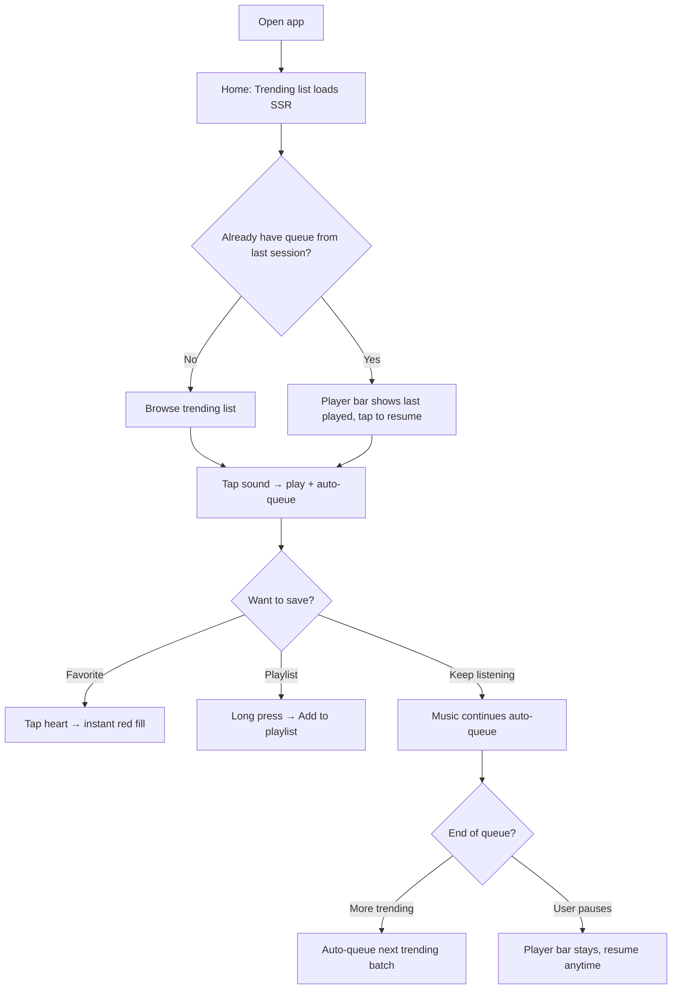
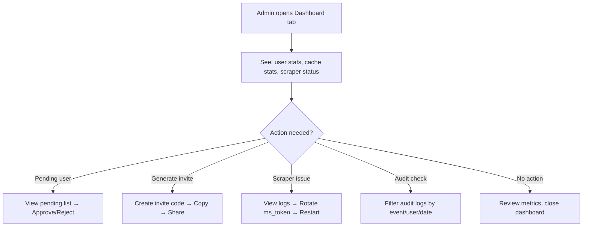

# UX Design Specification — toptop-music

**Author:** Nedd
**Date:** 2026-03-26

---

## Executive Summary

### Project Vision

toptop-music is a private, invite-only web music player that extracts audio from TikTok's trending sounds catalog for the Vietnam market. The UX goal: deliver a Spotify-like listening experience powered by TikTok's uniquely curated sound library. Users open the app, see what's trending, tap play, and listen continuously — no video, no ads, no scroll.

The design language bridges TikTok's brand identity (cyan, red, black, white) with Spotify's proven music player UX patterns. Dark mode is the primary theme, with light mode as a parallel option.

### Target Users

**Primary Persona — Minh (Daily Listener, 24, tech-savvy)**
Power user who creates playlists, uses search, queues sounds. Wants continuous listening without TikTok's video feed. Uses phone browser primarily.

**Secondary Persona — Lan (Casual Listener, non-tech)**
Opens app on Safari iPhone, taps trending sounds, favorites what she likes. Needs zero-learning-curve UI. If it's not obvious, she won't use it.

**Admin Persona — Nedd (System Admin)**
Manages users, invite codes, scraper health, audit logs. Needs a functional dashboard, not a pretty one.

**Access Model:** 5-15 users, friends & family, invite-only + open sign-up with admin approval.

### Key Design Challenges

1. **Persistent player across navigation** — Player bar must remain visible and uninterrupted during all page transitions. This is the #1 UX requirement for a music player web app.
2. **Mobile-first with touch optimization** — Majority of users access via phone browser. Large tap targets (minimum 44px), swipe gestures for queue management, responsive from 320px to 1024px+.
3. **Playback failure resilience UX** — When TikTok blocks or audio fails, the experience must degrade gracefully: auto-retry → skip → cached-only mode, with non-disruptive status messages.
4. **Non-tech user onboarding** — Registration to first play must take under 60 seconds with zero guidance needed.
5. **Dual theme support** — Dark mode (primary) and light mode built in parallel from day one.

### Design Opportunities

1. **"Zero-friction play"** — Trending list → tap → instant audio. Minimize every step between opening the app and hearing music. Auto-queue trending sounds when no explicit queue exists.
2. **TikTok-meets-Spotify visual identity** — TikTok's iconic color palette (cyan #25F4EE, red #FE2C55, black #010101, white #FFFFFF) applied to Spotify's proven layout patterns creates a distinctive yet familiar experience.
3. **Multi-language UI** — English as default with Vietnamese as secondary language option. UI labels in English, but content (sound titles, artist names) displayed as-is from TikTok (often Vietnamese).
4. **Smart queue behavior** — When user hasn't built a queue, auto-populate with trending sounds for continuous playback. Never let the music stop.

### Design Reference & Visual Direction

**Layout Reference:** Spotify (desktop + mobile web)

- Bottom persistent player bar
- Left sidebar navigation (desktop) / bottom tab bar (mobile)
- Card-based sound browsing
- Full-screen "now playing" view on mobile

**Color Palette (TikTok-inspired):**

- Primary: Cyan #25F4EE (accents, active states, links)
- Secondary: Red/Pink #FE2C55 (favorites heart, alerts, CTAs)
- Background Dark: #010101 (primary dark mode background)
- Background Light: #FFFFFF (primary light mode background)
- Surface Dark: #161616 (cards, player bar in dark mode)
- Surface Light: #F5F5F5 (cards, player bar in light mode)
- Text Primary Dark: #FFFFFF
- Text Primary Light: #010101
- Text Secondary: #8A8A8A (metadata, timestamps)

**Theme:** Dark mode primary, light mode parallel. User can toggle in settings.

## Core User Experience

### Defining Experience

The core interaction loop: **Open → Browse Trending → Tap → Listen Continuously**

When a user taps any sound from a list (trending, search results, playlist, favorites), that sound starts playing immediately and all subsequent sounds in that list are auto-queued. Music never stops unless the user explicitly pauses or the queue runs out. No auto-play on app open — the user initiates the first play.

The player bar is always visible at the bottom of every screen. Tapping or swiping up the player bar reveals a full-screen "Now Playing" view with cover art, controls, and queue access — identical to Spotify's mobile pattern.

Search is always accessible via a persistent search bar at the top of the main content area (YouTube Music pattern), enabling instant sound discovery without navigating away from the current view.

### Platform Strategy

**Primary Platform:** Mobile web browser (Chrome, Safari on phones)
**Secondary Platform:** Desktop web browser
**Approach:** Mobile-first responsive design, single codebase

| Aspect      | Mobile (320-767px)                                       | Tablet (768-1023px)   | Desktop (1024px+)                   |
| ----------- | -------------------------------------------------------- | --------------------- | ----------------------------------- |
| Navigation  | Bottom tab bar (4 tabs: Home, Search, Library, Admin)    | Bottom tab bar        | Left sidebar                        |
| Player      | Bottom bar (64px) → swipe up for full-screen Now Playing | Bottom bar → swipe up | Bottom bar (90px) → click to expand |
| Search      | Top search bar, always visible                           | Top search bar        | Top search bar in main content area |
| Sound cards | Full-width list items                                    | 2-column grid         | 3-4 column grid                     |
| Queue       | Full-screen drawer (swipe from right)                    | Side panel            | Side panel                          |

**Touch Optimization:**

- Minimum tap target: 44x44px
- Swipe up on player bar → Now Playing view
- Swipe right on sound card → add to queue
- Long press on sound card → context menu (add to playlist, favorite, share)
- Pull-to-refresh on trending list

**Offline Consideration:** PWA shell for basic offline access (cached sounds playable, trending list shows last cached version)

### Effortless Interactions

**Must be zero-friction:**

1. **First play** — Tap any sound → audio starts within 2 seconds. No confirmation dialogs, no loading screens blocking interaction.
2. **Continuous listening** — Auto-queue remaining sounds from current list. User never needs to manually build a queue to keep music playing.
3. **Favoriting** — Single tap on heart icon. Instant visual feedback (heart fills red #FE2C55). No toast notification needed — the animation IS the feedback.
4. **Navigation while playing** — Switch between Home, Search, Library tabs without any audio interruption. Player bar persists across all views.
5. **Registration** — Invite code pre-filled from link. Three fields (username, email, password) → tap "Create Account" → immediately see trending list. Under 30 seconds.

**Should happen automatically:**

- Queue auto-populates when user taps a sound from any list
- Trending list refreshes in background without user action
- Failed playback auto-retries from alternative source before showing any error
- Theme follows system preference on first visit (dark/light)

### Critical Success Moments

1. **"First Sound" moment** — User registers, sees trending list, taps first sound, hears music instantly. If this takes more than 5 seconds total (post-registration), we've failed.
2. **"It just keeps playing" moment** — User taps one sound, then puts phone down. 20 minutes later, music is still playing through the auto-queued trending list. This is the "better than TikTok" realization.
3. **"Found it" moment** — User remembers a sound from TikTok, types partial title in search bar, finds it in results, taps play. The search-to-play loop must feel instant.
4. **"Still works" moment** — TikTok is blocking, but cached sounds keep playing. User doesn't even notice the degradation. Resilience is invisible.
5. **"My music" moment** — User opens Library tab, sees their playlists and favorites organized. The app feels personal, not just a trending feed.

### Experience Principles

1. **Music First, Everything Else Second** — Every design decision prioritizes uninterrupted audio playback. If a feature could interrupt music, redesign it.
2. **Tap and Go** — Maximum one tap to start any action. No confirmation dialogs for common actions (play, favorite, queue). Undo over confirm.
3. **Invisible Resilience** — Errors, retries, and fallbacks happen silently. Users see status only when they need to act. The system handles problems before users notice them.
4. **Familiar Patterns, Fresh Identity** — Spotify's proven UX patterns with TikTok's visual identity. Users should feel at home immediately while knowing this is something different.
5. **Progressive Complexity** — Lan (non-tech) sees trending + play + favorite. Minh (power user) discovers playlists, queue management, search filters. Complexity reveals itself to those who seek it.

## Desired Emotional Response

### Primary Emotional Goals

1. **Relaxed & Immersed** — The app fades into the background. Users put on headphones, tap play, and enter a flow state. The UI never demands attention — music does. This is the "lean back" experience TikTok's video feed can never provide.

2. **Ownership & Identity** — "This is MY music app." Despite content sourced from TikTok, the favorites, playlists, and listening patterns make it feel personal. Users curate their own sound library. The Library tab is their space.

3. **Pleasant Discovery** — "Ồ bài này hay quá!" The trending list surfaces sounds users wouldn't find on their own. Every session has a moment of unexpected delight — a remix they didn't know existed, a creator sound that becomes their new favorite.

### Emotional Journey Mapping

| Stage                      | Desired Emotion         | Design Implication                                         |
| -------------------------- | ----------------------- | ---------------------------------------------------------- |
| First visit (registration) | Confident, welcomed     | Simple form, instant activation, friendly copy             |
| First play                 | Delight, surprise       | Instant audio, smooth animation, quality sound             |
| Browsing trending          | Curiosity, anticipation | Cover art visual appeal, trend rank badges, fresh content  |
| Continuous listening       | Relaxed, immersed       | No interruptions, seamless transitions between sounds      |
| Favoriting/playlisting     | Satisfaction, ownership | Instant feedback (heart animation), "saved" confirmation   |
| Search (found)             | Relief, accomplishment  | Fast results, clear match highlighting                     |
| Search (not found)         | Understanding, patience | Helpful message, not a dead end — "check back later"       |
| Playback failure           | Unaware → reassured     | Silent retry, graceful skip, "still works" cached fallback |
| Return visit               | Familiarity, comfort    | Favorites intact, playlists waiting, trending refreshed    |

### Micro-Emotions

**Confidence over Confusion** — Every interactive element communicates its purpose visually. Lan (non-tech) never wonders "what does this button do?" Icons are standard (▶️ play, ❤️ favorite, 🔍 search), labels present when space allows.

**Trust over Skepticism** — The app works reliably. Sounds play when tapped. Favorites persist across sessions. The system handles TikTok instability invisibly. Users trust that their data and preferences are safe.

**Delight over mere Satisfaction** — Small moments of polish: smooth cover art transitions, heart fill animation on favorite, subtle haptic feedback on mobile. The difference between "it works" and "it feels good."

**Belonging over Isolation** — Even as a private app for 5-15 people, the shared trending list creates a sense of "we're all listening to the same stuff." Future playlist sharing amplifies this.

### Design Implications

| Emotion            | UX Design Approach                                                                                                      |
| ------------------ | ----------------------------------------------------------------------------------------------------------------------- |
| Relaxed & Immersed | Minimal UI chrome, dark mode reduces visual stimulation, no pop-ups or modals during playback, smooth transitions       |
| Ownership          | Prominent Library tab, playlist customization (rename, reorder), favorites count visible, "Your Sounds" language        |
| Pleasant Discovery | Cover art prominently displayed, trend rank badges (#1, #2...), "New" tags on fresh sounds, usage count as social proof |
| Confidence         | Standard iconography, consistent interaction patterns, visible system status (playing indicator, loading states)        |
| Trust              | Persistent data across sessions, reliable playback, transparent error states (when shown), no data loss                 |
| Delight            | Micro-animations (heart fill, play button pulse, cover art fade-in), smooth page transitions, quality audio encoding    |

### Emotional Design Principles

1. **Calm over Busy** — Dark backgrounds, generous spacing, minimal text. The UI should feel like a dimly lit listening room, not a crowded dashboard.
2. **Feedback through Motion** — Animations communicate state changes instead of text notifications. Heart fills red = favorited. Play button pulses = loading. Cover art slides = track change.
3. **Errors are Whispers, Not Shouts** — Playback issues appear as subtle inline messages, never modal dialogs. The system fixes itself quietly. Only persistent failures surface to the user.
4. **Personal Space** — Library and favorites feel curated and personal. The app remembers preferences, last played position, and theme choice. Every return visit feels like coming home.

## UX Pattern Analysis & Inspiration

### Inspiring Products Analysis

**Spotify (Primary Layout Reference)**

What it does well:

- Bottom persistent player bar that never interrupts — the gold standard for music player UX
- "Now Playing" full-screen view with cover art, progress bar, and controls — swipe up to reveal, swipe down to dismiss
- Auto-queue behavior: tap a song in a playlist → all subsequent songs queue automatically
- Library organization: Playlists, Liked Songs, Recently Played as clear categories
- Search with category filters and instant results
- Smooth transitions between views — no jarring page reloads
- Dark theme as default creates immersive listening atmosphere

What to learn from:

- Navigation: left sidebar (desktop) / bottom tab bar (mobile) — proven pattern for content-heavy apps
- Player bar: compact (title + artist + play/pause + heart) → expandable to full-screen
- Card-based browsing: cover art + title + artist as atomic unit
- Queue management: slide-up panel, drag to reorder, swipe to remove

**TikTok (Visual Identity Reference)**

What it does well:

- Bold, high-contrast color palette (cyan #25F4EE, red #FE2C55, black, white) — instantly recognizable
- Full-screen immersive content consumption
- Minimal UI chrome — content takes center stage
- Smooth scroll and transition animations
- Sound-centric features: sound pages, trending sounds, sound search

What to learn from:

- Color as identity: cyan and red as accent colors create strong brand recognition
- Content-first layout: minimal navigation, maximum content area
- Trending presentation: rank numbers, usage counts as social proof
- Sound metadata display: title, artist, usage count, original/remix badge

### Transferable UX Patterns

**From Spotify → toptop-music:**

| Pattern           | Spotify Implementation                      | toptop-music Adaptation                          |
| ----------------- | ------------------------------------------- | ------------------------------------------------ |
| Persistent player | Bottom bar 64-90px, always visible          | Same — bottom bar with mini controls             |
| Now Playing view  | Swipe up → full-screen cover art + controls | Same — full-screen with TikTok color accents     |
| Auto-queue        | Tap song → queue rest of playlist/album     | Tap sound → queue rest of trending/playlist      |
| Library tabs      | Playlists, Liked Songs, Artists, Albums     | Playlists, Favorites (sounds only)               |
| Search            | Dedicated search tab with categories        | Always-visible search bar (YouTube Music hybrid) |
| Dark theme        | Default dark with green accents             | Default dark with cyan #25F4EE accents           |

**From TikTok → toptop-music:**

| Pattern         | TikTok Implementation             | toptop-music Adaptation                                   |
| --------------- | --------------------------------- | --------------------------------------------------------- |
| Color identity  | Cyan + red on black               | Same palette as primary design tokens                     |
| Trending ranks  | #1, #2... with view counts        | Trend rank badges + usage count on sound cards            |
| Sound pages     | Sound detail with videos using it | Sound detail with trending history (no videos)            |
| Content density | Full-screen, one item at a time   | List-based (Spotify style) but with TikTok visual density |
| Social proof    | View/like counts                  | Usage count ("150K videos use this sound")                |

### Anti-Patterns to Avoid

1. **TikTok's infinite scroll addiction loop** — toptop-music is for intentional listening, not mindless scrolling. No autoplay on open, no algorithmic "next" that hijacks attention. User controls the queue.
2. **Spotify's complex navigation depth** — Spotify has 4+ levels of navigation. toptop-music stays flat: Home, Search, Library. Maximum 2 levels deep.
3. **Modal interruptions during playback** — No "rate this app", no "upgrade to premium", no cookie banners over the player. Nothing interrupts music.
4. **Tiny touch targets on mobile** — All interactive elements minimum 44x44px. Player controls 48x48px.
5. **Loading states that block interaction** — No full-screen spinners. Skeleton screens for lists, inline loading for audio.

### Design Inspiration Strategy

**Adopt directly from Spotify:**

- Bottom persistent player bar architecture
- Now Playing full-screen view (swipe up/down)
- Auto-queue from list context
- Card-based sound browsing layout
- Library organization (Playlists + Favorites)

**Adopt directly from TikTok:**

- Color palette (cyan, red, black, white)
- Trend rank badges and usage count display
- Bold, high-contrast visual style

**Adapt (hybrid approach):**

- Search: persistent search bar at top of main content (YouTube Music style)
- Navigation: 4 bottom tabs (Home, Search, Library, Admin)
- Content density: TikTok's visual boldness applied to Spotify's list layout

**Avoid:**

- TikTok's addictive scroll patterns
- Spotify's deep navigation hierarchy
- Any modal that interrupts playback
- Small touch targets
- Blocking loading states

## Design System Foundation

### Design System Choice

**Tailwind CSS + Custom Components** — No component library. All UI components built from scratch using Tailwind utility classes, giving full control over every pixel.

**Animation Libraries:**

- **Framer Motion** — React animation library for page transitions, player bar expand/collapse, cover art transitions, heart fill animation, and micro-interactions
- **tailwindcss-animate** — Tailwind plugin for simple CSS animations (fade-in, slide-up, pulse)

### Rationale for Selection

1. **Full customization control** — No fighting against a component library's opinions. TikTok's color palette and Spotify's layout patterns require pixel-level control that pre-built component libraries constrain.
2. **Lightweight bundle** — Tailwind purges unused CSS. No heavy component library JS. Critical for mobile-first performance targets (FCP < 1.5s).
3. **Solo dev velocity** — Nedd knows Tailwind. No learning curve for a new component API. Write the HTML/JSX you want, style it with utilities.
4. **Dark/light mode native** — Tailwind's `dark:` variant prefix makes dual-theme trivial. Define CSS variables for color tokens, toggle a class on `<html>`.
5. **Learning objective alignment** — Building custom components from scratch aligns with the full-stack learning goal.

### Implementation Approach

**Tailwind Configuration:**

```
tailwind.config.ts
├── theme.extend.colors — TikTok palette tokens
├── theme.extend.spacing — Player bar heights, tap targets
├── theme.extend.animation — Custom keyframes
├── darkMode: 'class' — Class-based dark mode toggle
└── plugins: [tailwindcss-animate]
```

**Color Token System (CSS Variables):**

```css
:root {
  --color-primary: #25f4ee; /* Cyan — accents, active states */
  --color-secondary: #fe2c55; /* Red — favorites, alerts, CTAs */
  --color-bg: #ffffff; /* Light mode background */
  --color-surface: #f5f5f5; /* Light mode cards */
  --color-text: #010101; /* Light mode text */
  --color-text-secondary: #8a8a8a; /* Metadata, timestamps */
}

.dark {
  --color-bg: #010101; /* Dark mode background */
  --color-surface: #161616; /* Dark mode cards */
  --color-text: #ffffff; /* Dark mode text */
}
```

**Custom Component Architecture:**

| Component     | Purpose                     | Key Tailwind Patterns                   |
| ------------- | --------------------------- | --------------------------------------- |
| `PlayerBar`   | Persistent bottom player    | `fixed bottom-0`, `dark:bg-surface`     |
| `NowPlaying`  | Full-screen expanded player | `fixed inset-0`, Framer Motion slide-up |
| `SoundCard`   | Sound list item             | `flex`, cover art + metadata + actions  |
| `SearchBar`   | Persistent search input     | `sticky top-0`, `focus:ring-primary`    |
| `TabBar`      | Bottom navigation (mobile)  | `fixed bottom-[64px]`, 4 tabs           |
| `Sidebar`     | Left navigation (desktop)   | `hidden lg:flex`, `w-64`                |
| `QueueDrawer` | Queue slide panel           | Framer Motion slide-from-right          |
| `HeartButton` | Favorite toggle             | Framer Motion scale + color fill        |

### Customization Strategy

**No abstraction layers** — Components use Tailwind classes directly. No CSS-in-JS, no styled-components, no component library wrappers.

**Responsive strategy:**

- Mobile-first: base classes = mobile
- `md:` prefix = tablet (768px+)
- `lg:` prefix = desktop (1024px+)

**Animation strategy:**

- Framer Motion for complex animations (player expand, page transitions, gesture-based interactions)
- Tailwind `animate-*` for simple states (fade-in on mount, pulse on loading, spin on refresh)
- `prefers-reduced-motion` respected via Tailwind's `motion-reduce:` variant

## Defining Experience

### The One-Line Description

**"Tap trending, hear music instantly, it never stops."**

This is what Minh tells his friends. This is what makes toptop-music different from opening TikTok. One tap → continuous audio → no video, no ads, no scroll.

### User Mental Model

**Current behavior (problem):**
Minh hears a sound on TikTok → Shazam it → search on Spotify → maybe finds it, maybe not (VN remixes often missing) → if found, adds to playlist → finally listens. 5+ steps, 2+ apps, frequent dead ends.

**Expected behavior (toptop-music):**
Open app → see what's trending → tap → listen. 3 steps, 1 app, zero dead ends for trending content.

**Mental model users bring:**

- "This is like Spotify but for TikTok sounds" — they expect Spotify-like player behavior
- "Trending = what's hot right now" — they expect fresh content, not a static catalog
- "Play = continuous" — tapping one sound means music keeps going (auto-queue expectation from Spotify)
- "Heart = save" — universal pattern, no learning needed

### Success Criteria

| Criteria           | Metric                                          | Feeling                        |
| ------------------ | ----------------------------------------------- | ------------------------------ |
| Tap to audio       | < 2 seconds (cached)                            | "That was instant"             |
| Continuous play    | Zero gaps between sounds                        | "It just keeps going"          |
| Queue auto-fill    | Remaining list items queued on tap              | "I didn't have to do anything" |
| Search to play     | < 3 seconds total (type → result → tap → audio) | "Found it immediately"         |
| Favorite           | Single tap, instant visual feedback             | "Saved" (no thought required)  |
| Player persistence | Zero interruption on navigation                 | "Music never stopped"          |

### Pattern Analysis: Established with Unique Twist

**Established patterns adopted:**

- Spotify's player bar + Now Playing + auto-queue = proven music player UX
- Heart icon for favorites = universal
- Search bar at top = standard discovery pattern
- Bottom tab navigation = mobile standard

**Unique twist:**

- Content source is TikTok trending — the "trending" concept is the differentiator
- Trend rank badges (#1, #2...) + usage counts create TikTok-native social proof in a Spotify-like layout
- No album/artist hierarchy — sounds are flat, equal, trending-ranked. Simpler mental model than traditional music apps
- Playback resilience is invisible — users never know TikTok is the source or that it might fail

### Experience Mechanics

**1. Initiation — User opens app:**

- Trending list loads immediately (SSR, < 1.5s FCP)
- Search bar visible at top
- No auto-play — screen is silent, waiting for user's first tap
- Cover art thumbnails create visual invitation to explore

**2. Interaction — User taps a sound:**

- Sound starts playing within 2 seconds
- Player bar slides up from bottom (Framer Motion, 200ms ease-out)
- All sounds below the tapped one auto-queue
- Cover art, title, artist visible in player bar
- Heart icon and play/pause controls accessible in mini player

**3. Feedback — During playback:**

- Progress bar fills in real-time (cyan #25F4EE)
- Currently playing sound highlighted in list (subtle cyan left border)
- Sound transitions are crossfade (200ms overlap) — no silence gaps
- If playback fails: silent retry → skip → cached-only mode (user sees nothing unless persistent failure)

**4. Completion — Queue ends or user pauses:**

- When queue exhausts: player bar stays visible showing last played sound, play button ready
- Pause: player bar remains, cover art stays, resume anytime
- Close browser: next visit, player bar shows last played sound (localStorage state)

## Visual Design Foundation

### Color System

**TikTok-Inspired Palette with Semantic Mapping:**

| Token              | Dark Mode | Light Mode | Usage                                        |
| ------------------ | --------- | ---------- | -------------------------------------------- |
| `--primary`        | #25F4EE   | #25F4EE    | Accents, active states, progress bars, links |
| `--secondary`      | #FE2C55   | #FE2C55    | Favorites heart, alerts, destructive CTAs    |
| `--bg`             | #010101   | #FFFFFF    | Page background                              |
| `--surface`        | #161616   | #F5F5F5    | Cards, player bar, modals                    |
| `--surface-hover`  | #1E1E1E   | #EBEBEB    | Hover state for cards/list items             |
| `--surface-active` | #252525   | #E0E0E0    | Active/pressed state                         |
| `--text`           | #FFFFFF   | #010101    | Primary text                                 |
| `--text-secondary` | #8A8A8A   | #6B6B6B    | Metadata, timestamps, placeholders           |
| `--text-tertiary`  | #555555   | #999999    | Disabled text, hints                         |
| `--border`         | #2A2A2A   | #E5E5E5    | Dividers, input borders                      |
| `--success`        | #4ADE80   | #16A34A    | Success states, "restored" messages          |
| `--warning`        | #FBBF24   | #D97706    | Warning states, ⚠️ indicators                |
| `--error`          | #FE2C55   | #FE2C55    | Error states (shares secondary color)        |

**Contrast Ratios (WCAG AA):**

- `--text` on `--bg`: 21:1 (dark), 21:1 (light) ✅
- `--text-secondary` on `--bg`: 5.3:1 (dark), 4.6:1 (light) ✅
- `--primary` on `--bg`: 12.4:1 (dark) ✅
- `--secondary` on `--bg`: 5.6:1 (dark) ✅

### Typography System

**Font Stack:**

- Primary: `Inter` — clean, modern, excellent readability at small sizes, variable font for performance
- Fallback: `-apple-system, BlinkMacSystemFont, 'Segoe UI', sans-serif`
- Monospace (admin): `'JetBrains Mono', 'Fira Code', monospace`

**Type Scale (rem-based, 16px root):**

| Token         | Size            | Weight | Line Height | Usage                    |
| ------------- | --------------- | ------ | ----------- | ------------------------ |
| `--text-xs`   | 0.75rem (12px)  | 400    | 1.33        | Badges, timestamps       |
| `--text-sm`   | 0.875rem (14px) | 400    | 1.43        | Metadata, secondary info |
| `--text-base` | 1rem (16px)     | 400    | 1.5         | Body text, list items    |
| `--text-lg`   | 1.125rem (18px) | 500    | 1.44        | Sound titles in list     |
| `--text-xl`   | 1.25rem (20px)  | 600    | 1.4         | Section headers          |
| `--text-2xl`  | 1.5rem (24px)   | 700    | 1.33        | Page titles              |
| `--text-3xl`  | 1.875rem (30px) | 700    | 1.27        | Now Playing title        |

### Spacing & Layout Foundation

**Base Unit:** 4px (Tailwind default)
**Spacing Scale:** 0, 1, 2, 3, 4, 5, 6, 8, 10, 12, 16, 20, 24 (in Tailwind units)

**Key Spacing Tokens:**

| Token                     | Value        | Usage                             |
| ------------------------- | ------------ | --------------------------------- |
| `--space-card-padding`    | 12px (p-3)   | Internal card padding             |
| `--space-list-gap`        | 8px (gap-2)  | Gap between list items            |
| `--space-section-gap`     | 24px (gap-6) | Gap between sections              |
| `--space-page-padding`    | 16px (px-4)  | Page horizontal padding (mobile)  |
| `--space-page-padding-lg` | 24px (px-6)  | Page horizontal padding (desktop) |

**Layout Constants:**

| Element                 | Mobile    | Desktop       |
| ----------------------- | --------- | ------------- |
| Player bar height       | 64px      | 90px          |
| Tab bar height          | 56px      | N/A (sidebar) |
| Search bar height       | 48px      | 48px          |
| Sidebar width           | N/A       | 256px (w-64)  |
| Cover art (list)        | 48x48px   | 56x56px       |
| Cover art (Now Playing) | 280x280px | 320x320px     |
| Minimum tap target      | 44x44px   | 36x36px       |

### Iconography

**Icon System:** Lucide React (open-source, consistent, tree-shakeable)
**Icon Size:** 20px default, 24px for player controls, 16px for inline
**Icon Style:** Outline (default), Filled (active states — e.g., filled heart for favorited)

**Core Icons:**

| Action          | Icon              | Active State              |
| --------------- | ----------------- | ------------------------- |
| Play            | `Play`            | `Pause`                   |
| Skip Next       | `SkipForward`     | —                         |
| Skip Previous   | `SkipBack`        | —                         |
| Favorite        | `Heart` (outline) | `Heart` (filled, #FE2C55) |
| Search          | `Search`          | —                         |
| Queue           | `ListMusic`       | —                         |
| Volume          | `Volume2`         | `VolumeX` (muted)         |
| Home            | `Home`            | `Home` (filled)           |
| Library         | `Library`         | `Library` (filled)        |
| Settings        | `Settings`        | —                         |
| Add to Playlist | `Plus`            | `Check`                   |
| More Options    | `MoreHorizontal`  | —                         |

## Design Direction

### Chosen Direction: "Dark Immersive Player"

**Concept:** Dark-dominant interface where content (cover art, trending badges) provides the color. UI chrome is minimal and recedes. The player bar is the anchor — always present, always accessible. TikTok's cyan and red appear as precise accents, never overwhelming.

**Visual Characteristics:**

- Near-black backgrounds (#010101) with subtle surface elevation (#161616)
- Cover art is the primary color source — large, vibrant, eye-catching
- Cyan (#25F4EE) used sparingly: progress bars, active tab indicators, links
- Red (#FE2C55) reserved for: favorite hearts, error states, destructive actions
- White text on dark surfaces — high contrast, easy reading
- Rounded corners: 8px for cards, 12px for modals, full-round for buttons/avatars
- Subtle borders (#2A2A2A) for separation, not heavy dividers

**Light Mode Variant:**

- Same layout, inverted colors
- White backgrounds, light gray surfaces
- Same cyan/red accent usage
- Slightly muted cover art shadows for depth

## User Journey Flows

### Journey Flow 1: First-Time Registration → First Play

```mermaid
flowchart TD
    A[User opens invite link] --> B[Registration page]
    B --> C{Has invite code?}
    C -->|Yes, pre-filled| D[Fill username, email, password]
    C -->|No| E[Choose: Enter code OR Sign up for approval]
    E -->|Enter code| D
    E -->|Sign up for approval| F[Fill username, email, password]
    F --> G[Submit → "Pending approval" screen]
    G --> H[Wait for admin approval email]
    H --> I[Login]
    D --> J[Submit → Account active immediately]
    J --> K[Redirect to Home / Trending]
    I --> K
    K --> L[See trending list + search bar]
    L --> M[Tap any sound]
    M --> N[Player bar slides up, audio plays]
    N --> O[Remaining sounds auto-queue]
```

### Journey Flow 2: Daily Listening Session



### Journey Flow 3: Search → Play

```mermaid
flowchart TD
    A[Type in search bar] --> B[Results appear as-you-type]
    B --> C{Found it?}
    C -->|Yes| D[Tap sound → play]
    C -->|No results| E[Show: "No results. Trending updates every 30-60 min."]
    E --> F[User browses trending instead]
    D --> G[Sound plays, search results become queue context]
```

### Journey Flow 4: Playback Failure Recovery

```mermaid
flowchart TD
    A[Sound playing] --> B[Audio fails]
    B --> C[Silent: retry from alternative source]
    C --> D{Retry success?}
    D -->|Yes| E[Audio resumes, show "Restored ✓" briefly]
    D -->|No| F[Skip to next in queue]
    F --> G{Next sound available?}
    G -->|Yes| H[Play next sound]
    G -->|No, 3+ consecutive fails| I[Toast: "Connection issue. Playing cached sounds."]
    I --> J[Filter queue to cached-only]
    J --> K[Continue playing cached sounds]
```

### Journey Flow 5: Admin Dashboard



## Component Strategy

### Core Components (MVP — Phase 1)

| Component        | Description                                                                   | States                                            | Priority |
| ---------------- | ----------------------------------------------------------------------------- | ------------------------------------------------- | -------- |
| `SoundCard`      | List item: cover art (48px) + title + artist + duration + heart + rank badge  | default, playing (cyan border), hover, loading    | Critical |
| `PlayerBar`      | Fixed bottom: cover art (40px) + title/artist + play/pause + heart + progress | collapsed, expanded (Now Playing), loading, error | Critical |
| `NowPlaying`     | Full-screen: large cover art + controls + progress + queue access             | playing, paused, loading, error recovery          | Critical |
| `SearchBar`      | Sticky top: input + clear button + loading indicator                          | empty, typing, loading, results, no-results       | Critical |
| `TabBar`         | Fixed bottom (mobile): Home, Search, Library, Admin icons + labels            | default, active (cyan indicator)                  | Critical |
| `Sidebar`        | Fixed left (desktop): navigation links + user avatar + theme toggle           | collapsed, expanded                               | Critical |
| `QueueDrawer`    | Slide-from-right panel: ordered sound list + drag-to-reorder                  | open, closed, empty                               | High     |
| `HeartButton`    | Favorite toggle: outline → filled red with scale animation                    | unfavorited, favorited, animating                 | High     |
| `PlaylistCard`   | Playlist item: name + sound count + cover art mosaic                          | default, hover, playing                           | High     |
| `TrendBadge`     | Rank indicator: #1, #2... with usage count                                    | top-3 (highlighted), standard                     | Medium   |
| `Toast`          | Non-disruptive message: slides in from top, auto-dismisses                    | info, success, warning, error                     | Medium   |
| `SkeletonLoader` | Placeholder while content loads: pulsing gray shapes                          | loading                                           | Medium   |

### Admin Components (MVP)

| Component             | Description                                           | Priority |
| --------------------- | ----------------------------------------------------- | -------- |
| `AdminDashboard`      | Stats grid: users, cache, scraper, disk               | Critical |
| `InviteCodeGenerator` | Form: expiry selector + generate + copy               | High     |
| `PendingUserList`     | Table: username, email, date + approve/reject buttons | High     |
| `AuditLogViewer`      | Filterable table: event, user, IP, date               | Medium   |
| `ScraperStatus`       | Status card: health, last fetch, failure rate         | Medium   |

### Component States Convention

All interactive components follow this state pattern:

- `default` → `hover` → `active/pressed` → `disabled`
- `loading` (skeleton or spinner)
- `error` (red border or inline message)
- `success` (green check or brief animation)
- `empty` (helpful empty state with action suggestion)

## UX Consistency Patterns

### Button Hierarchy

| Level       | Style                                     | Usage               | Example                             |
| ----------- | ----------------------------------------- | ------------------- | ----------------------------------- |
| Primary     | Cyan bg (#25F4EE), black text, rounded-lg | Main CTAs           | "Create Account", "Create Playlist" |
| Secondary   | Transparent, cyan border, cyan text       | Secondary actions   | "Cancel", "View All"                |
| Destructive | Red bg (#FE2C55), white text              | Destructive actions | "Delete Playlist", "Reject User"    |
| Ghost       | Transparent, text-secondary, no border    | Tertiary actions    | "Skip", "Maybe Later"               |
| Icon        | 44x44px touch target, icon only           | Inline actions      | Play, Heart, More                   |

### Feedback Patterns

| Type            | Visual                                             | Duration        | Interaction             |
| --------------- | -------------------------------------------------- | --------------- | ----------------------- |
| Success         | Green toast, top-center, slide-down                | 3s auto-dismiss | Tap to dismiss          |
| Error           | Red toast, top-center, slide-down                  | 5s auto-dismiss | Tap to dismiss or retry |
| Loading         | Skeleton screens (lists), inline spinner (buttons) | Until complete  | Non-blocking            |
| Playback status | Inline text below player bar, subtle               | 3s auto-dismiss | Non-interactive         |
| Empty state     | Centered illustration + message + CTA              | Persistent      | CTA to resolve          |

### Form Patterns

- Labels above inputs (not floating)
- Real-time validation on blur
- Error messages below input in red (#FE2C55), text-sm
- Submit button disabled until form valid
- Loading state on submit button (spinner replaces text)

### Navigation Patterns

- Mobile: bottom tab bar (4 tabs) + player bar above it
- Desktop: left sidebar (256px) + player bar at bottom
- Active tab: cyan indicator (bottom border on mobile, left border on desktop)
- Page transitions: Framer Motion fade + slide (200ms)
- Back navigation: browser back button, no custom back arrows needed (flat navigation)

### Empty States

| Screen              | Message                                                  | CTA               |
| ------------------- | -------------------------------------------------------- | ----------------- |
| Favorites (empty)   | "No favorites yet. Tap ❤️ on any sound to save it here." | "Browse Trending" |
| Playlists (empty)   | "No playlists yet. Create one to organize your sounds."  | "Create Playlist" |
| Search (no results) | "No sounds found. Trending updates every 30-60 min."     | "Browse Trending" |
| Queue (empty)       | "Queue is empty. Tap a sound to start playing."          | —                 |

## Responsive Design & Accessibility

### Responsive Breakpoints

| Breakpoint | Range      | Layout Changes                                                           |
| ---------- | ---------- | ------------------------------------------------------------------------ |
| Mobile     | 320-767px  | Bottom tab bar, full-width cards, stacked layout, 64px player bar        |
| Tablet     | 768-1023px | Bottom tab bar, 2-column grid, side queue panel, 72px player bar         |
| Desktop    | 1024px+    | Left sidebar (256px), 3-4 column grid, side queue panel, 90px player bar |

### Key Responsive Behaviors

**Player Bar:**

- Mobile: 64px, cover art 40px, title truncated, play/pause + heart only
- Desktop: 90px, cover art 56px, full title + artist, play/pause + heart + skip + volume + progress

**Now Playing:**

- Mobile: full-screen overlay, swipe down to dismiss, large cover art (80vw)
- Desktop: expanded panel (right side, 400px wide) or modal, click outside to dismiss

**Sound Cards:**

- Mobile: full-width list items, horizontal layout (cover + text + actions)
- Tablet: 2-column grid, card layout with cover art on top
- Desktop: 3-4 column grid or list view toggle

**Search:**

- Mobile: search bar collapses into tab bar icon, expands on tap (full-width overlay)
- Desktop: always visible in main content header area

### Accessibility Strategy

**Target:** WCAG 2.1 AA compliance

**Keyboard Navigation:**

- Tab order: search bar → sound list → player controls → navigation
- `Space` / `Enter` to play/pause
- Arrow keys for volume and seek in Now Playing
- `Escape` to close Now Playing / Queue drawer
- Skip link to main content

**Screen Reader Support:**

- All images have `alt` text (cover art: "{title} by {artist}")
- Player state announced: "Now playing: {title} by {artist}"
- Trend rank announced: "Trending number {rank}"
- Heart state announced: "Add to favorites" / "Remove from favorites"
- Live region for playback status changes

**Focus Management:**

- Visible focus ring (2px cyan outline, 2px offset)
- Focus trapped in modals (Now Playing, Queue drawer)
- Focus returns to trigger element when modal closes

**Reduced Motion:**

- `prefers-reduced-motion: reduce` → disable Framer Motion animations
- Replace slide/fade transitions with instant state changes
- Keep essential feedback (heart color change) but remove scale animation

**Touch Accessibility:**

- All interactive elements minimum 44x44px
- Adequate spacing between touch targets (minimum 8px gap)
- No gesture-only interactions — all swipe actions have button alternatives
